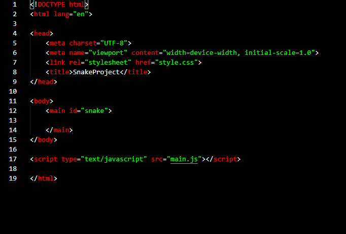
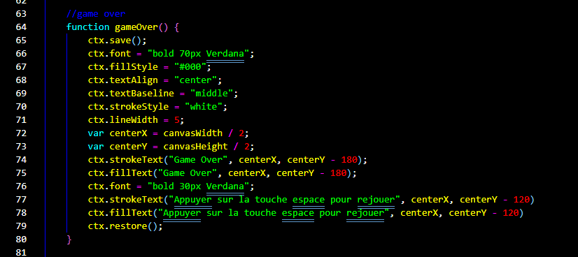

# PLOP

## my theme for vsc

### objective of the project

I wanted to have a very contrasting theme without finding one, so I decided to modify an already existing theme.
the project uses json and xml.

## preview

### HTML :

### JavaScript :

